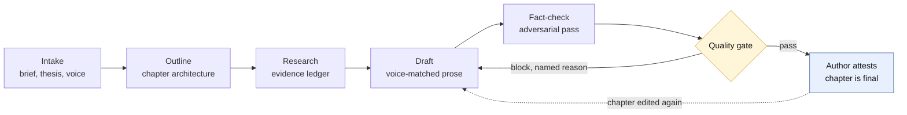

<a id="readme-top"></a>

<div>

# [Nonfiction Studio](https://github.com/prisant-labs/nonfiction-studio)

**Turns Claude into a governed non-fiction book studio: specialist subagents draft, a plain-Markdown project bible (the book's own canonical files, all plain Markdown you own) holds the truth, and a deterministic quality gate decides what counts as done. For Claude Code.**

Most AI writing tools generate plausible prose and leave the verification to you. Nonfiction Studio inverts that. Every factual assertion is anchored to a ledger entry or tagged `[UNVERIFIED]`, voice drift is measured rather than eyeballed, and no chapter reaches its terminal status until a gate you can run yourself says so and you attest to it by name. The author stays in charge throughout: the studio proposes, checks, and drafts; you accept, revise, or reject.

<p>
  <a href="https://github.com/prisant-labs/nonfiction-studio/issues/new?labels=bug">Report a Bug</a>
  &nbsp;&middot;&nbsp;
  <a href="https://github.com/prisant-labs/nonfiction-studio/issues/new?labels=enhancement">Request a Feature</a>
  &nbsp;&middot;&nbsp;
  <a href="docs/README.md">Read the Docs</a>
</p>

<p>
  
  <a href="LICENSE"></a>
  
  
  <a href="#the-catalog"></a>
  <a href="#subagents"></a>
  <a href="#command-line-engines"></a>
  <a href="https://agentskills.io/specification"></a>
</p>

<p>
  <a href="#install"><strong>Install</strong></a>
  &nbsp;&middot;&nbsp;
  <a href="#quickstart"><strong>Quickstart</strong></a>
  &nbsp;&middot;&nbsp;
  <a href="#what-it-is"><strong>What it is</strong></a>
  &nbsp;&middot;&nbsp;
  <a href="#the-governed-loop"><strong>The loop</strong></a>
  &nbsp;&middot;&nbsp;
  <a href="#the-catalog"><strong>Catalog</strong></a>
  &nbsp;&middot;&nbsp;
  <a href="docs/README.md"><strong>Docs</strong></a>
</p>

</div>

---

<details>
<summary><strong>Table of Contents</strong></summary>

- [Install](#install)
- [Quickstart](#quickstart)
- [What it is](#what-it-is)
- [What makes it different](#what-makes-it-different)
- [The governed loop](#the-governed-loop)
- [The catalog](#the-catalog)
- [Surfaces](#surfaces)
- [Find your way in](#find-your-way-in)
- [Documentation](#documentation)
- [Project status](#project-status)
- [Self-sufficiency](#self-sufficiency)
- [Privacy and memory](#privacy-and-memory)
- [Contributing](#contributing)
- [License](#license)
- [About the maintainer](#about-the-maintainer)

</details>

---

## Install

Nonfiction Studio is listed in the [prisant-labs marketplace](https://github.com/prisant-labs/agent-plugins), which catalogs every plugin published under [prisant-labs](https://github.com/prisant-labs).

**From the marketplace** (once this repository is public):

```
/plugin marketplace add prisant-labs/agent-plugins
/plugin install nonfiction-studio@agent-plugins
```

You **add** the marketplace by its repo path and **install** by the marketplace identity (`@agent-plugins`): the path is the address, the identity is the catalog. Add the marketplace once and every plugin published there becomes available, including ones added later.

**From a local clone** (what works today):

```
claude plugin marketplace add /path/to/nonfiction-studio
claude plugin install nonfiction-studio@nonfiction-studio
```

Replace `/path/to/nonfiction-studio` with wherever you cloned or unzipped it. The plugin carries a self-marketplace in its own repository, which is what makes the local directory install work; that is why the identity differs between the two paths.

> **Availability.** The marketplace listing exists and is live, but this repository is not public yet, so the marketplace path will fail to resolve until the public flip. The local-clone path is the supported route in the meantime. Requires Node 22.12 or later.

<div align="right">(<a href="#readme-top">back to top</a>)</div>

## Quickstart

The fastest way to see what this plugin does: paste your own writing and get a real, measured result back, with no project setup at all.

1. **Open Claude Code in any folder.**
2. **Run `/nonfiction-studio:nfs-quick-scan`** and paste 500 to 1000 words of your own prose. You get back a voice profile measured by the same deterministic engine the plugin uses everywhere else, a claim scan flagging sentences that assert a fact needing a source, and a one-paragraph read on what it is about. The measured parts and the model-judged parts are kept visibly distinct.
3. **Run `/nonfiction-studio:nfs-tour`** to watch the quality gate work: it passes on the bundled sample book, blocks on a planted, realistic defect with a named reason, then passes again once the defect is fixed. The tour runs from a disposable copy; nothing touches the shipped example.
4. **Ready to write your own book?** Run `/nonfiction-studio:nfs-start` and choose "Start a new book."

That last step leads to the intake interview: a real 45 to 90 minute session that captures your book's thesis, audience, and voice. Budget for it honestly. Success in that session means a confirmed project brief, not a drafted chapter. Steps 2 and 3 are previews, not a substitute for it.

See [docs/quickstart.md](docs/quickstart.md) for the fuller walkthrough, or open [examples/sample-book/](examples/sample-book/) directly: a complete two-chapter project called "The Quiet Network," with a full bible, research ledger, and gate history already in place.

<div align="right">(<a href="#readme-top">back to top</a>)</div>

## What it is

Nonfiction Studio is a Claude Code plugin that runs a structured authoring workflow for a non-fiction book, from the first intake question to publisher-ready back matter. Four things work together.

- **A team of specialist subagents.** An interviewer that captures the brief, a thesis architect, a structure architect, a voice-capture agent, a research librarian, a drafting partner, an adversarial fact-checker, and a line editor. Each has a bounded role and a defined moment it is invoked.
- **A plain-Markdown project bible.** Your book's state lives in ordinary files in your own folder: `context/`, `structure/`, `chapters/`, `research/`, `production/`. No database, no proprietary format, no lock-in. You can read, diff, and version-control every one of them.
- **Deterministic engines behind every measurement.** Voice drift, claim coverage, quote fidelity, and state coherence are computed by Node programs you can run yourself, not judged by a model. The same engine that scores your chapter scores it identically tomorrow.
- **A quality gate that runs before anything counts as done.** Six checks, a named verdict, and a written report. It fires automatically as a Stop hook where hooks are available, and it is a command you can run by hand anywhere.

## What makes it different

| It is | It is not |
|---|---|
| **Evidence-anchored** - every factual assertion links to a ledger entry or carries an `[UNVERIFIED]` tag | A prose generator that leaves sourcing to you |
| **Deterministic where it matters** - drift, coverage, and coherence are measured by engines, not judged by a model | A model grading its own output |
| **Author-governed** - a chapter reaches its terminal status only on a dated human attestation, and falls back automatically if it is edited afterward | An autonomous writer that decides when it is finished |
| **Yours, in plain files** - a Markdown bible in your own folder, readable and diffable without this plugin | A proprietary project format |
| **Self-sufficient** - runs on the Claude login you already have, with no API key and no third-party service | A tool that needs a separate account or paid backend |
| **Honest about compliance** - an AI-use log, chapter snapshots, and publisher-ready apparatus are first-class outputs | A tool that hides how the manuscript was made |

<div align="right">(<a href="#readme-top">back to top</a>)</div>

## The governed loop

The workflow is a loop, not a pipeline. The gate is what closes it, and a block sends work back with a named reason rather than a score.



**The gate runs six checks**, each producing its own verdict rather than a single opaque score:

| Check | What it asks |
|---|---|
| `claim_coverage` | Does every factual assertion resolve to an evidence-ledger entry, or is it honestly tagged? |
| `quote_fidelity` | Does every verbatim quote match its recorded source text? |
| `stylometry` | Has the prose drifted from the author's measured voice baseline, and by how much? |
| `prompt_scrub` | Is there residue of AI instruction or scaffolding left in the manuscript? |
| `continuity` | Do the facts, names, and commitments hold across chapters? |
| `state_coherence` | Do the recorded word counts and project state agree with what is actually on disk? |

A verdict is `pass`, `warn`, or `block`, and a block names the check and the finding. The report is written into your project, so the next run, the status board, and you are all reading the same artifact. See [docs/formats/gate-report.md](docs/formats/gate-report.md) for the report format.

**Promotion is a ceremony, not a status change.** Marking a chapter `final` requires a dated attestation entry in `context/decisions.md` naming you as the actor and the chapter as the subject. If an attested chapter is edited afterward, it falls back automatically, so the board cannot claim a chapter is finished after it changed. Recorded in [ADR-0011 (tranche 2 decisions)](docs/adr/ADR-0011-tranche-2-decisions.md).

<div align="right">(<a href="#readme-top">back to top</a>)</div>

## The catalog

**14 skills, 8 subagents, 9 CLIs, and 2 output styles**, plus hooks on six events. Every component has a reference page under `docs/reference/`, indexed from [docs/README.md](docs/README.md), and most ship a worked example alongside it.

### Skills

Skills are what you invoke, as `/nonfiction-studio:<name>`. Each one orchestrates rather than improvises: it checks preconditions, delegates the real work to a subagent or a CLI, confirms what was written, and tells you what to do next.

**Preview and front door (3)**

- **[nfs-quick-scan](docs/reference/skills/nfs-quick-scan.md)** - paste 500 to 1000 words and get three things back: a voice profile measured by the same `ns-stylometry` engine the gate uses, a scan for sentences that assert a fact needing a source, and a one-paragraph editorial read. The measured half and the model-judged half stay visibly separate, so you always know which is which. Needs no project and writes only to a temp file.
- **[nfs-tour](docs/reference/skills/nfs-tour.md)** - a four-beat walkthrough of the bundled sample book: the gate passes, honestly reporting the stylometry check as advice-only below the book-scale verdict floor rather than inventing a margin, a realistic AI-residue defect is planted, the gate blocks with a named reason, the defect is fixed, and the gate passes again. Runs entirely in a disposable copy, so neither the shipped example nor any project of yours is touched.
- **[nfs-start](docs/reference/skills/nfs-start.md)** - the guided front door. Presents six numbered paths (start a new book, continue writing, research and verify, review quality and status, troubleshoot, quick preview) and routes you to the right skill for where the book actually is. Use it when you are starting a session without a clear intent; the sixth path needs no project at all.

**Set up the project (3)**

- **[nfs-new-book](docs/reference/skills/nfs-new-book.md)** - creates the project's folder structure in one pass: `context/` (brief, audience, decisions, style profile), `structure/` (thesis, outline, comps), `chapters/`, `research/` (evidence log, sources, open questions), and `production/` (front matter, back matter, exports), plus the `.studio/` state files the hooks and CLIs read. Every file sits at a predictable top-level path rather than buried in nested or generated directories, so you can find, read, and edit any of it without going through the plugin. It detects an existing project and offers to fill in only what is missing rather than overwriting your work.
- **[nfs-interview](docs/reference/skills/nfs-interview.md)** - the adaptive intake session that produces a confirmed `context/brief.md`, walking ten sections from project basics and thesis through audience, comps, scope, voice, research posture, logistics, ethics, and your own definition of done. It is resumable: answers are flushed to the brief section by section, so an interrupted session picks up where it stopped instead of restarting. Budget 45 to 90 minutes, and expect a confirmed brief at the end, not a drafted chapter.
- **[nfs-capture-voice](docs/reference/skills/nfs-capture-voice.md)** - builds the numeric voice baseline that every later drift statistic is measured against, from writing samples you supply. It produces two things: `context/style-profile.md`, readable prose rules you can edit by hand, and the marker vector `ns-stylometry` actually scores against. If you have no samples to hand, it falls back to a bootstrap loop where the studio generates three candidate passages and you react to them until the profile is right.

**Shape the book (1)**

- **[nfs-outline](docs/reference/skills/nfs-outline.md)** - turns a confirmed brief into a chapter-by-chapter architecture. It sharpens the controlling idea first through `thesis-architect` when no thesis exists yet, hands chapter structure to `structure-architect`, then puts the draft outline in front of you for acceptance before anything is committed. A scope argument lets you run only the thesis work, or only the chapter work against a thesis you already have.

**Research, draft, verify (3)**

- **[nfs-research](docs/reference/skills/nfs-research.md)** - runs a structured research session that fills the evidence ledger with evidence entries and source references. It shows you the research agenda for approval before gathering anything, delegates every ledger write to `research-librarian`, and closes by reporting new sources, new evidence entries, and which claims in scope are still open. This is what makes later fact-checking possible at all: a claim can only be verified against a source that is already registered.
- **[nfs-draft](docs/reference/skills/nfs-draft.md)** - produces a chapter draft that matches your measured voice and anchors every factual assertion to a ledger entry or tags it `[UNVERIFIED]`. It warns you if the evidence ledger is empty before drafting rather than inventing citations, routes new prose or diff proposals through `drafting-partner`, then passes the accepted text to `line-editor` for polish that arrives as proposals rather than as edits already made. Works on a new chapter or continues one already in progress.
- **[nfs-fact-check](docs/reference/skills/nfs-fact-check.md)** - the adversarial verification pass over a drafted chapter. It runs an engine-backed claim inventory through `ns-claims` first, then hands the chapter to `fact-checker`, which advances each evidence entry from pending to verified, unverified, interpretation, or source-unverifiable and writes a per-chapter report. You get three counts back and the report path. Use this when you want claim-level truth; use the quality gate when you want a pass-or-block verdict on the whole chapter.

**Check the state (3)**

- **[nfs-check-chapter](docs/reference/skills/nfs-check-chapter.md)** - runs the deterministic gate over a chapter and translates the verdict into plain language, including which check blocked and what to do about it. It works on every surface, including chat, where hooks never fire and this is the only way to get a verdict. If your voice baseline is missing or stale it degrades honestly to the checks it can still run and tells you the voice check was skipped, rather than reporting a pass that did not measure everything.
- **[nfs-status-dashboard](docs/reference/skills/nfs-status-dashboard.md)** - narrates the per-chapter board straight from `ns-status`: status, word count, open claims, drift statistic, and latest gate verdict for each chapter, plus whole-book totals. Rows the engine itself flags, meaning drift above that same row's own calibrated threshold or a blocking verdict, are marked as such. It computes nothing and writes nothing of its own, so what you read is exactly what the engine reports.
- **[nfs-doctor](docs/reference/skills/nfs-doctor.md)** - the diagnostic front door, and the first thing to run when something looks wrong. Its default report checks bible integrity end to end: folder structure, file schemas, evidence and source marker grammar, orphan markers, cross-references, word-count coherence, config validity, snapshot naming, and style-profile structure, then groups the findings by type with a routing hint for each. Read-only by default; the single write it can perform, installing the status line, is offered explicitly and never happens without a yes.

**Ship it (1)**

- **[nfs-build-apparatus](docs/reference/skills/nfs-build-apparatus.md)** - turns the evidence ledger into publisher-ready back matter: Chicago-style endnotes with real locators, a deduplicated bibliography, and index-term candidates. It also produces an honest needs-attention list naming every ledger entry still missing a locator or a source, so you find out before a copy editor does. Read-then-emit only: it never writes to your ledger, your sources, or your chapters.

### Subagents

Eight bounded specialist roles. None of them is a general-purpose writer: each is invoked by a skill at a defined moment, does one job, and hands back. The permitted invocations are declared in `agents/_chain-permitted.yaml`, so an agent cannot quietly call another one.

- **[interviewer](docs/reference/agents/interviewer.md)** - conducts the intake conversation and writes the project bible from it, covering all ten sections from project basics to your definition of done. It flushes each section as it is confirmed, which is what makes an interrupted interview resumable.
- **[thesis-architect](docs/reference/agents/thesis-architect.md)** - sharpens the controlling idea before any structure is drawn, on the principle that an outline built on a vague thesis produces chapters that cannot be argued. Also invoked mid-project when the thesis shifts during drafting.
- **[structure-architect](docs/reference/agents/structure-architect.md)** - translates a confirmed thesis into chapter-by-chapter architecture: what each chapter must establish, in what order, and where the evidence hooks attach. Revises an existing outline as readily as it draws a new one.
- **[voice-capture](docs/reference/agents/voice-capture.md)** - measures your writing samples into an operational voice profile and the marker vector behind it. When no samples exist, it runs a three-passage generate-and-react loop instead, so a voice baseline is still reachable for an author who has not written the book yet.
- **[research-librarian](docs/reference/agents/research-librarian.md)** - gathers, organizes, and registers research for one chapter or the whole book, writing every source and evidence entry into the ledger in the ledger's own grammar. It is the only agent permitted to write to the research files.
- **[drafting-partner](docs/reference/agents/drafting-partner.md)** - produces voice-matched, claim-anchored chapter prose, either as new text or as diff proposals against a chapter that already exists. Every factual assertion it writes is anchored to a ledger entry or explicitly tagged `[UNVERIFIED]`; it does not invent a citation to fill a gap.
- **[fact-checker](docs/reference/agents/fact-checker.md)** - runs the adversarial verification pass, advancing each evidence entry from pending to verified, unverified, interpretation, or source-unverifiable, and writing the per-chapter report. It is mandatory in the Stop-gate sequence, after the claims engine has measured coverage.
- **[line-editor](docs/reference/agents/line-editor.md)** - applies clarity, grammar, consistency, and rhythm edits, always as proposals rather than as changes already made. It flags anything that would alter meaning, and it never removes or rewrites a claim marker, so polishing cannot silently break the evidence chain.

### Command-line engines

The deterministic spine. Each is a thin shell over an engine in `hooks/lib/`, so the skill, the hook, and you all get identical results. Run any of them yourself.

| CLI | What it does |
|---|---|
| [`ns-gate`](docs/reference/cli/ns-gate.md) | Orchestrates the quality gate and writes the verdict report. |
| [`ns-claims`](docs/reference/cli/ns-claims.md) | Inventories claim markers and reports evidence coverage. |
| [`ns-stylometry`](docs/reference/cli/ns-stylometry.md) | Measures voice drift against the baseline; `--explain` makes a score interrogable. |
| [`ns-scrub`](docs/reference/cli/ns-scrub.md) | Detects prompt-injection residue and cross-chapter continuity breaks. |
| [`ns-status`](docs/reference/cli/ns-status.md) | Computes the read-only chapter board and whole-book totals. |
| [`ns-statusline`](docs/reference/cli/ns-statusline.md) | A zero-token status view for the Claude Code status line. |
| [`ns-doctor`](docs/reference/cli/ns-doctor.md) | Read-only bible integrity check across structure, schemas, and state. |
| [`ns-notes`](docs/reference/cli/ns-notes.md) | Generates endnotes, bibliography, and index candidates from the ledger. |
| [`ns-overlap`](docs/reference/cli/ns-overlap.md) | Detects n-gram overlap between chapter prose and your own research packets, verbatim excerpts, and prior work. |

### Output styles

Optional, off by default, and never imposed - `nfs-new-book` offers both once per project; you can also pick one yourself at any time with the built-in `/config` command. Either style changes only how Claude's replies are shaped; nothing on disk changes. See [Output styles](docs/reference/output-styles.md) for activation and deactivation.

| Style | What it changes |
|---|---|
| `manuscript` | Prose-first drafting responses: no unrequested bullet summaries, no code fences around chapter prose, quoted passages instead of diffs for line edits, claim-marker discipline preserved throughout. |
| `review` | Terse, verdict-first, tabular responses for gate, status, and diagnostic work. |

### Hooks

Hooks on six events keep the studio honest without you asking: `SessionStart` restores context, `PreToolUse` guards write scope and the web-research gate, `PostToolUse` wraps every fetched result in an untrusted-content envelope before Claude reads it, `PostToolBatch` maintains chapter state and automatic demotion, `Stop` runs the quality gate, and `PreCompact` preserves what matters across a context boundary.

<div align="right">(<a href="#readme-top">back to top</a>)</div>

## Surfaces

Nonfiction Studio targets three places Claude runs, and they are not equally proven.

| Surface | What to expect |
|---|---|
| **Claude Code CLI** | Full support. This is where the plugin has actually been built and exercised. |
| **Cowork** | Expected to work the same way, but unverified. A hook-execution spike is still pending; see [ADR-0002 (Cowork hook execution)](docs/adr/ADR-0002-cowork-hook-execution.md). |
| **claude.ai chat** | Skills only. Hooks do not fire on chat, so the quality gate does not run automatically there; run `/nonfiction-studio:nfs-check-chapter` yourself when you want a verdict. |

If you try Nonfiction Studio in Cowork, treat it as "should work" rather than "proven to work" until ADR-0002 (Cowork hook execution) is resolved.

<div align="right">(<a href="#readme-top">back to top</a>)</div>

## Find your way in

- **Just want to see if it is any good** - `/nonfiction-studio:nfs-quick-scan` with your own prose, then `/nonfiction-studio:nfs-tour`. Five minutes, no setup.
- **Want to read before installing** - [examples/sample-book/](examples/sample-book/), a finished two-chapter project with its bible, ledger, and gate history intact.
- **Ready to start a book** - `/nfs-start`, then "Start a new book." Block out 45 to 90 minutes for intake.
- **Something looks wrong in your project** - `/nonfiction-studio:nfs-doctor` first, always.
- **Want to know how a measurement works** - the CLI reference in [docs/README.md](docs/README.md) and the file-format specs in [docs/formats/](docs/formats/gate-report.md); every number has an engine behind it.
- **Want to know why it is built this way** - the architecture decision records in [docs/adr/](docs/adr/ADR-0011-tranche-2-decisions.md).
- **Worried about disclosure and compliance** - [docs/privacy.md](docs/privacy.md) and the AI-use log format in [docs/formats/ai-use-log.md](docs/formats/ai-use-log.md).

<div align="right">(<a href="#readme-top">back to top</a>)</div>

## Documentation

- [`docs/README.md`](docs/README.md) - the documentation index: a reference page for every skill, subagent, and CLI the plugin ships.
- [`docs/quickstart.md`](docs/quickstart.md) - the fuller walkthrough, from install to a first drafted chapter.
- [`docs/privacy.md`](docs/privacy.md) - what is stored, where, and how to delete it, including the AI-use log and chapter snapshots.
- [`docs/formats/`](docs/formats/gate-report.md) - the file-format specs for the project bible: evidence log, sources, claim markers, gate report, decisions, style profile, and more.
- [`docs/adr/`](docs/adr/ADR-0011-tranche-2-decisions.md) - architecture decision records behind the major engineering calls.
- [`docs/gates/phase-1-gate.md`](docs/gates/phase-1-gate.md) - the recorded Phase 1 gate outcome.
- [`MIGRATION.md`](MIGRATION.md) - what counts as a breaking change to a book already in progress.
- [`CHANGELOG.md`](CHANGELOG.md) and [`RELEASE-NOTES.md`](RELEASE-NOTES.md) - the technical history and the curated, author-facing summaries.

<div align="right">(<a href="#readme-top">back to top</a>)</div>

## Project status

**`v0.1.0`, pre-release, under construction.** Phase 1, the core authoring workflow, is complete and exercised. Later work (deeper research tooling, a revision pass, manuscript export, and further publishing-compliance features) is still being built, and rough edges are expected. No version has been tagged yet.

### At a glance

|  |  |
|---|---|
| **Current version** | `0.1.0` (source of truth: [`library.json`](library.json)) |
| **Status** | Pre-release; Phase 1 complete, later phases in progress |
| **Components** | 14 skills, 8 subagents, 9 CLIs, 2 output styles, hooks on six events |
| **Conformance** | `universal` (Bronze) at Standard 0.12 |
| **Agent targets** | Claude Code (Cowork pending verification; chat is skills-only) |
| **Runtime** | Node 22.12 or later; one runtime dependency (a YAML parser) |
| **CI** | Two tiers. Tier A is keyless and deterministic and runs on every pull request across two operating systems; Tier B is model-integration, manual-dispatch, and advisory only. |
| **Install** | [`prisant-labs/agent-plugins`](https://github.com/prisant-labs/agent-plugins) marketplace, or a local clone |
| **License** | [MIT](LICENSE) |

### Repo structure

```
nonfiction-studio/
├── skills/              # The invokable skills (a SKILL.md each)
├── agents/              # The specialist subagents + the chain contract
├── bin/                 # The ns-* command-line engines (+ .cmd shims for Windows)
├── hooks/               # Hook scripts, hooks.json, and the deterministic engines
│   └── lib/             #   gate, claims, stylometry, scrub, status, doctor, apparatus
├── scripts/             # The Tier A validation spine and the test runners
│   └── checks/          #   per-check modules (inventory, links, counts, routing targets)
├── docs/                # Reference, formats, ADRs, quickstart, privacy
├── examples/            # sample-book (a finished project), fixtures, spikes
├── templates/           # Book scaffold, agent and hook starters, config defaults
├── tests/               # Engine unit tests and fixture matrices
├── library.json         # The canonical component manifest and version source of truth
└── .claude-plugin/      # plugin.json and the self-marketplace for local installs
```

### Changelog

Full technical detail in [`CHANGELOG.md`](CHANGELOG.md); curated, author-facing highlights in [`RELEASE-NOTES.md`](RELEASE-NOTES.md). Everything currently sits under `Unreleased`, because no version has been tagged.

<div align="right">(<a href="#readme-top">back to top</a>)</div>

## Self-sufficiency

Nonfiction Studio runs entirely on a working Claude Code or Cowork login. Every skill, subagent, hook, and CLI here rides the model access your session already has. None of them call a model API directly, and none require a separate API key, account, or paid service.

Tier B (model-integration CI) stays inside that same boundary: it authenticates with `CLAUDE_CODE_OAUTH_TOKEN`, an OAuth token a maintainer mints from their own subscription with `claude setup-token`, not an API key. It runs on manual dispatch only, is advisory only, and is never required to open or merge a pull request; when the token secret is not set, the workflow skips green with a named reason instead of failing. Running it yourself needs only your existing `claude` CLI login. See [ADR-0010 (Tier B trigger and credential)](docs/adr/ADR-0010-tier-b-trigger-and-credential.md) for the full contract.

Optional online research (DOI and URL lookups) uses Claude's own WebSearch and WebFetch tools, stays off by default, and falls back to author-pasted source text whenever it is unavailable or disabled, rather than blocking.

<div align="right">(<a href="#readme-top">back to top</a>)</div>

## Privacy and memory

The fact-checker keeps a small cache of verified claims at `.claude/agent-memory/nonfiction-studio-fact-checker/` inside your project folder, so it does not re-verify the same claim against the same source twice. It stores claim and source verification outcomes only, never your unpublished manuscript text wholesale. Delete that directory any time to clear it; it simply rebuilds as you keep working.

Everything lives in your project folder and on your own machine. Nothing is sent anywhere beyond your own Claude session. See [docs/privacy.md](docs/privacy.md) for the fuller note, including the AI-use log and chapter snapshots.

<div align="right">(<a href="#readme-top">back to top</a>)</div>

## Contributing

Contributions are welcome. Pull requests run a fully keyless, deterministic CI check (Tier A) across two operating systems; you never need an API key to develop or test this plugin. The model-integration check (Tier B) exists for maintainers, runs on manual dispatch only, and is advisory, never a merge requirement and never a trigger on pull requests.

Before opening a pull request:

1. Run the suites: `node scripts/test-engines.mjs` and `node scripts/test-fixtures.mjs`.
2. Run the validation spine: `node scripts/check.mjs --profile plain-plugin`, plus the individual checks under `scripts/checks/`. CI runs the same set.
3. Add a `CHANGELOG.md` entry under `Unreleased`. The changelog is written from what actually landed, not from what was planned.

A fuller contributing guide will follow. For now, open an [issue](https://github.com/prisant-labs/nonfiction-studio/issues) or a pull request.

<div align="right">(<a href="#readme-top">back to top</a>)</div>

## License

Distributed under the **[MIT License](LICENSE)**. Copyright 2026 JP Prisant.

The validation tooling vendored under `scripts/` is licensed separately under the Apache License 2.0; see [`scripts/LICENSE-APACHE`](scripts/LICENSE-APACHE) and [`scripts/ATTRIBUTION.md`](scripts/ATTRIBUTION.md).

<div align="right">(<a href="#readme-top">back to top</a>)</div>

## About the maintainer

<a href="https://github.com/jprisant"></a>

Built and maintained by **JP Prisant** ([@jprisant](https://github.com/jprisant)). Nonfiction Studio started from a simple frustration: AI writes fluent non-fiction very fast, and fluent non-fiction with unsourced claims and a borrowed voice is worse than no draft at all. The fix is not a better prompt. It is governance the author controls and can audit: measured voice, anchored claims, a gate with a named verdict, and a terminal status nobody but you can grant.

*If this plugin has kept you from shipping a claim you could not source, consider starring the repo.*

<p align="center">
  <strong>Built by <a href="https://github.com/prisant-labs">prisant-labs</a></strong><br>
  <sub>A governed non-fiction book studio, in plain Markdown, on your own machine</sub>
</p>

<div align="right">(<a href="#readme-top">back to top</a>)</div>
